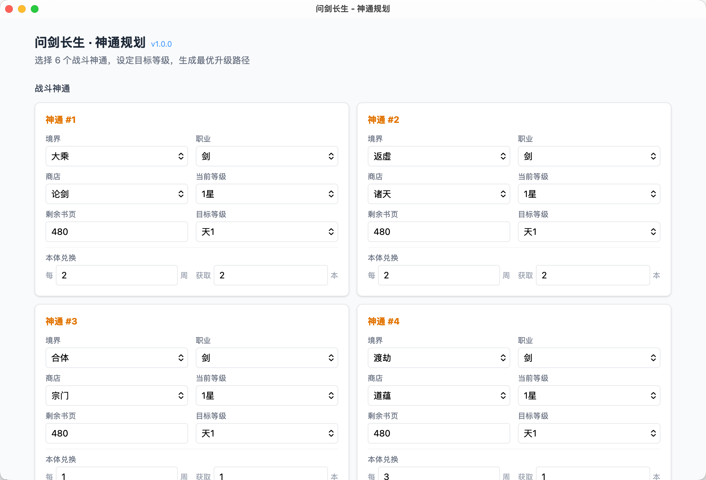
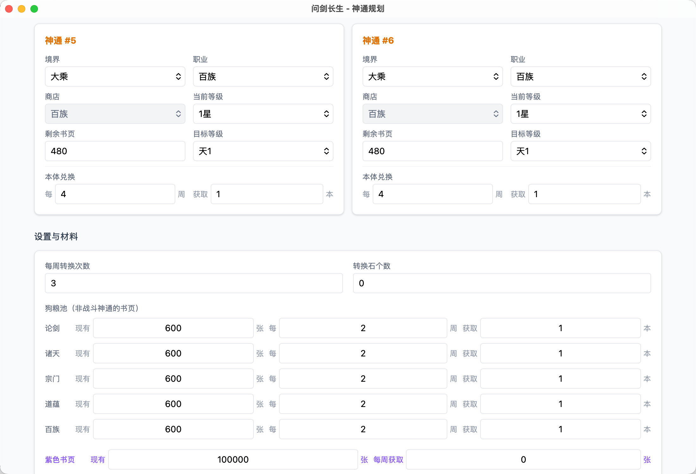
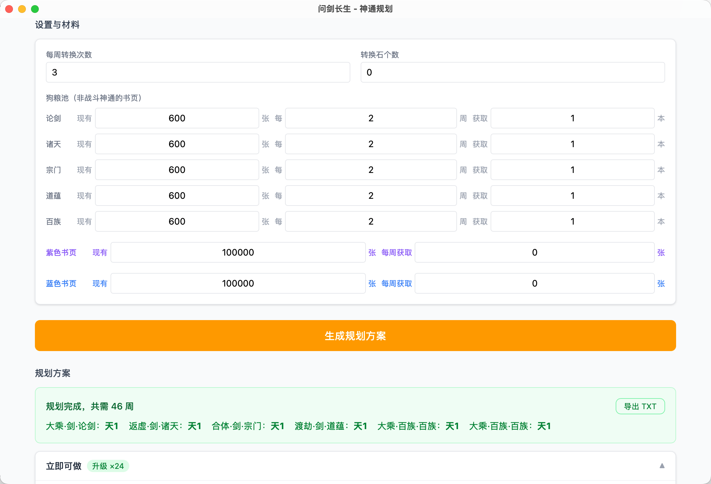
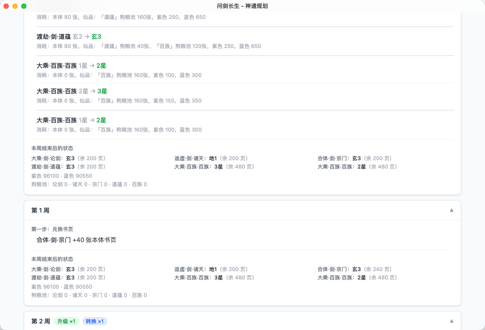

# 问剑长生 · 神通升级规划工具

> 手游《问剑长生》的神通升级规划桌面应用，帮助玩家计算最优的按周升级路径。

## 功能特性

- **一键规划** — 输入 6 个战斗神通的当前状态（境界、职业、商店、等级、剩余书页）和目标等级，自动计算最少周数达成所有目标
- **逐周操作指引** — 生成每周详细步骤：兑换书页、转换书页、升级神通，按图索骥不再迷路
- **穷举最优解** — 达成目标后自动利用剩余资源继续提升等级，穷举搜索保证方案最优
- **导出方案** — 支持导出规划方案为 TXT 文件，方便分享或离线查阅
- **自动保存** — 所有设置自动持久化，重启应用后保留上次输入

## 截图

<table>
  <tr>
    <td></td>
    <td></td>
  </tr>
  <tr>
    <td></td>
    <td></td>
  </tr>
</table>

## 安装

前往 [Releases](https://github.com/yuman07/WenjianSkill/releases/latest) 页面下载对应平台的安装包。

> 本应用未进行代码签名，首次运行时操作系统会弹出安全警告，请按照下方说明操作。

### macOS 14.0+ (Sonoma) Apple Silicon

1. 下载 `WenjianSkill_macOS14_arm64_1.0.0.dmg`
2. 打开 DMG 文件，将应用拖入「应用程序」文件夹
3. 首次打开时，macOS Gatekeeper 会弹出"无法验证开发者"的提示。解决方法（任选其一）：
   - 前往 **系统设置 → 隐私与安全性**，找到被拦截的应用，点击「仍要打开」
   - 右键点击应用，选择「打开」，在弹出的对话框中再次点击「打开」
   - 在终端中执行 `xattr -cr /Applications/WenjianSkill.app` 移除隔离属性后再打开

### Windows 10+ x64

1. 下载 `WenjianSkill_Win10_x64_1.0.0.exe`
2. 双击即可运行，无需安装（便携式应用，可放在任意目录）
3. 首次运行时，Windows SmartScreen 会弹出「Windows 已保护你的电脑」的提示，点击「更多信息」→「仍要运行」即可

## 算法说明

### 资源模型

每个神通升级需要消耗四种资源：

| 资源 | 说明 |
|------|------|
| **本体书页** | 该神通自身的书页，只能通过同商店转换获得 |
| **仙品书页** | 来自其他神通的多余书页或狗粮池，跨商店通用 |
| **紫色书页** | 全局通用资源，每周固定收入 |
| **蓝色书页** | 全局通用资源，每周固定收入 |

不同境界和职业的组合（如"合体·剑"、"大乘·百族"）对应不同的升级消耗表，最高可升级到天 3 或天 5。

书页来源包括：神通自身的周期性收入、5 个商店（论剑/诸天/宗门/道蕴/百族）的狗粮池、以及每周转换次数（免费次数 + 转换石）。同商店内的书页可以互相转换为本体书页，每次转换固定 40 张。

### 阶段一：二分搜索最少周数

给定周数 W，可行性检查验证以下条件是否全部满足：

1. **紫色 / 蓝色书页充足** — 初始存量 + W 周收入 ≥ 所有神通的总需求
2. **各商店本体书页充足** — 每个商店内的技能书页 + 狗粮池 ≥ 该商店所有技能的本体需求
3. **转换次数充足** — 本体书页不足的技能需要通过转换补足，总转换次数 ≤ 免费次数 × W + 转换石数量
4. **仙品书页充足** — 各商店的剩余书页（扣除本体需求后的盈余）≥ 所有技能的仙品总需求；同时单独检查每个技能的仙品可用量（排除自身书页不能给自己当仙品的约束）

以上检查均为 O(n) 复杂度。在 \[0, 500\] 的范围内进行二分搜索，即可在 O(n log 500) ≈ 9n 次检查内找到精确的最少周数。

### 阶段二：穷举搜索 bonus 等级

达成目标后通常还有剩余资源。引擎会尝试在已确定的最少周数内，将每个神通尽可能再多升几级。

每个神通的额外可升级数最多为 5 级（目标到天 5 的差值），6 个神通的组合空间最多为 5⁶ = 15,625 种。对每种组合调用阶段一的可行性检查，取总等级提升最大的可行方案。搜索采用分支定界（branch-and-bound）剪枝：从高 bonus 向低 bonus 搜索以尽早找到好解，并用「当前累计 + 剩余上界 ≤ 已知最优」的条件跳过不可能更优的分支。

### 阶段三：逐周模拟生成操作步骤

确定最终目标等级后，模拟器按周推进，每周执行：

1. **结算收入** — 各技能和狗粮池按周期发放书页，紫色/蓝色书页按周增加
2. **交替执行转换与升级** — 循环进行直到无法继续：
   - **升级优先级**：优先升级仙品需求较少的技能（减少对共享资源的竞争），同等条件下优先升级离目标更近的技能（尽早释放书页盈余）
   - **转换来源优先级**：同商店狗粮池优先于其他技能的盈余
   - **仙品消耗优先级**：珍贵度低的资源优先消耗（论剑 > 诸天 = 宗门 > 道蕴 > 百族）

模拟器同时记录每步操作（兑换了哪些书页、转换了哪些、升了哪些级），最终输出为逐周操作计划。

## 技术栈

| 层级 | 技术 |
|------|------|
| 桌面框架 | Tauri 2 (macOS / Windows) |
| 前端 | React 19 + TypeScript + Tailwind CSS 4 |
| 后端算法 | Rust |
| 构建工具 | Vite |

## 开发

项目使用 [Devbox](https://www.jetify.com/devbox/) 管理所有开发依赖（Node.js、Rust 等），无需手动安装各语言工具链。

### 前置要求

- macOS 14.0 (Sonoma) 或更高版本，Apple Silicon (M 系列芯片)
- Xcode Command Line Tools

### 构建步骤

```bash
# 1. 安装 Xcode Command Line Tools（提供编译器和系统头文件）
xcode-select --install

# 2. 安装 Devbox（项目依赖管理工具，自动安装 Node.js、Rust 等）
curl -fsSL https://get.jetify.com/devbox | bash

# 3. 克隆仓库
git clone https://github.com/yuman07/WenjianSkill.git

# 4. 进入项目目录
cd WenjianSkill

# 5. 安装前端依赖
devbox run -- npm install

# 6. 开发模式（热重载）
devbox run -- npm run tauri dev

# 7. 构建发布版本（生成 .dmg）
devbox run -- npm run tauri build
```

## License

[MIT](LICENSE)
