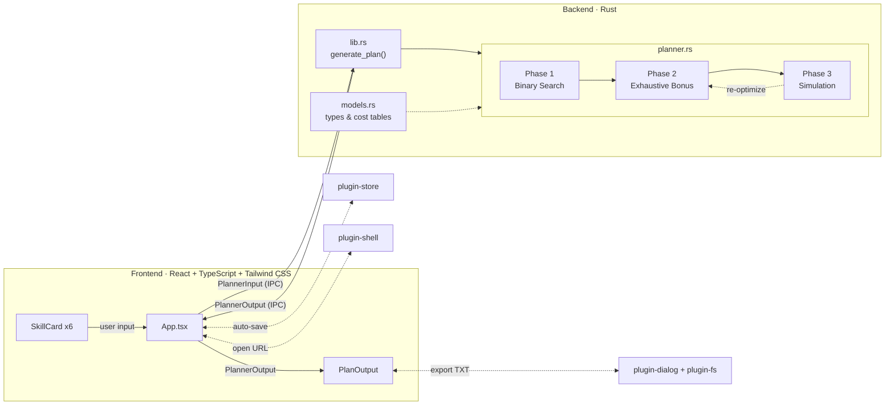

<p align="center"></p>

<h1 align="center">问剑长生 · 神通升级规划</h1>

<p align="center"><strong>手游《问剑长生》的神通升级规划桌面应用，帮助玩家计算最优的按周升级路径</strong></p>

<p align="center">
  <a href="https://github.com/yuman07/WenjianSkill/releases/latest"></a>
  <a href="https://github.com/yuman07/WenjianSkill/releases"></a>
  <a href="https://github.com/yuman07/WenjianSkill/stargazers"></a>
  <br>
  
  
  
  
  <a href="LICENSE"></a>
</p>

---

## 这是什么？

WenjianSkill 是手游《问剑长生》的**神通升级规划工具**。玩家输入 6 个战斗神通的当前状态和目标等级，应用会自动计算出达成目标所需的**最少周数**，并生成**逐周操作步骤**——兑换哪些书页、转换哪些书页、升级哪个神通，全部安排妥当。

达成目标后，引擎还会自动利用剩余资源**穷举搜索**最优的额外提升方案，确保每一份资源都不浪费。

## 功能特性

- **一键规划** — 输入 6 个战斗神通的当前状态（境界、职业、商店、等级、剩余书页）和目标等级，自动计算最少周数达成所有目标
- **逐周操作指引** — 生成每周详细步骤：兑换书页、转换书页、升级神通，按图索骥不再迷路
- **穷举最优解** — 达成目标后自动利用剩余资源继续提升等级，穷举搜索保证方案最优
- **导出方案** — 支持导出规划方案为 TXT 文件，方便分享或离线查阅
- **自动保存** — 所有设置自动持久化，重启应用后保留上次输入

<p align="center">
  
  
</p>
<p align="center">
  
  
</p>

## 安装

前往 [Releases](https://github.com/yuman07/WenjianSkill/releases/latest) 页面下载对应平台的安装包。

> **注意：** 本应用未进行代码签名，首次运行时操作系统会弹出安全警告，请按照下方说明操作。

### macOS (14.0+, Apple Silicon)

1. 下载 `WenjianSkill_macOS14_arm64_1.0.0.dmg`
2. 打开 DMG 文件，将应用拖入「应用程序」文件夹
3. 首次打开时，macOS Gatekeeper 会弹出"无法验证开发者"的提示。解决方法（任选其一）：
   - **系统设置**：前往 **系统设置 → 隐私与安全性**，找到被拦截的应用，点击「仍要打开」
   - **右键打开**：右键点击应用图标，选择「打开」，在弹出的对话框中再次点击「打开」
   - **终端命令**：在终端中执行以下命令移除隔离属性，然后再打开应用：
     ```bash
     xattr -cr /Applications/WenjianSkill.app
     ```

### Windows (10+, x64)

1. 下载 `WenjianSkill_Win10_x64_1.0.0.exe`
2. 双击即可运行，无需安装（便携式应用，可放在任意目录）
3. 首次运行时，Windows SmartScreen 会弹出「Windows 已保护你的电脑」的提示，点击「更多信息」→「仍要运行」即可

## 开发

> 仅支持 macOS，不提供其他平台的构建步骤。

项目使用 [Devbox](https://www.jetify.com/devbox/) 管理所有开发依赖（Node.js、Rust 等），无需手动安装各语言工具链。

### 前置要求

- macOS 15.6 (Sequoia) 或更高版本，Apple Silicon (M 系列芯片)
- Xcode Command Line Tools 26 或更高版本

### 构建步骤

```bash
# 1. 安装 Xcode Command Line Tools（提供编译器和系统链接器）
xcode-select --install

# 2. 安装 Devbox（项目依赖管理工具，自动安装 Node.js 24、Rust 等）
curl -fsSL https://get.jetify.com/devbox | bash

# 3. 克隆仓库
git clone https://github.com/yuman07/WenjianSkill.git

# 4. 进入项目目录
cd WenjianSkill

# 5. 安装前端依赖
devbox run -- npm install

# 6. 开发模式（热重载，前端自动刷新）
devbox run -- npm run tauri dev

# 7. 构建发布版本（生成 .dmg 安装包）
devbox run -- npm run tauri build
```

## 技术概览

WenjianSkill 采用 Tauri 2 架构，前端使用 React 渲染 UI，后端使用 Rust 执行核心规划算法。前后端通过 Tauri IPC 通信：用户在 React 界面填写技能配置和材料预算后，`App.tsx` 组装 `PlannerInput` 并调用 Rust 端的 `generate_plan` 命令，Rust 引擎执行三阶段优化算法后返回 `PlannerOutput`，前端渲染逐周操作方案。

用户状态通过 Tauri plugin-store 自动持久化到本地，规划方案可通过 plugin-dialog + plugin-fs 导出为格式化 TXT 文件。

### 核心算法

引擎采用**三阶段优化**策略：

**阶段一：二分搜索最少周数。** 给定周数 W，O(n) 可行性检查验证四个约束——紫色/蓝色书页充足、各商店本体书页充足、转换次数充足、金色书页充足（含单技能约束）。在 \[0, 500\] 范围二分搜索，O(n log 500) ≈ 9n 次检查找到精确最少周数。

**阶段二：穷举搜索 bonus 等级。** 达成目标后通常有剩余资源。引擎穷举每个技能从目标到最高等级的组合，对每种组合调用阶段一可行性检查，取总等级提升最大的方案。采用分支定界剪枝：从高 bonus 向低 bonus 搜索以尽早找到好解，用「当前累计 + 剩余上界 ≤ 已知最优」跳过劣解分支。

**阶段三：逐周模拟。** 确定最终目标后按周推进——结算收入、交替执行转换与升级。转换和升级使用多维度优先级策略（金色需求少的优先升级、同商店狗粮优先转换、珍贵度低的资源优先消耗为金色等）。若模拟超出预期周数，引擎用实际周数重新运行阶段二，迭代直至 bonus 等级收敛。

### 技术栈

| 层级 | 技术 |
|------|------|
| 桌面框架 | Tauri 2 (macOS / Windows) |
| 前端 | React 19 + TypeScript 6 + Tailwind CSS 4 |
| 前端构建 | Vite 8 |
| 后端算法 | Rust (Edition 2024) |
| 开发环境 | Devbox (Node.js 24, Rust 1.94+) |

### 架构



### 项目结构

```
|-- src/                        # 前端（React + TypeScript）
|   |-- App.tsx                 #   主界面：管理 6 个技能输入状态、材料设置、调用后端
|   |-- components/
|   |   |-- SkillCard.tsx       #   技能卡片：境界/职业/商店/等级/书页输入
|   |   `-- PlanOutput.tsx      #   规划结果：逐周展开卡片、导出 TXT
|   |-- types/
|   |   |-- game.ts             #   游戏数据：枚举定义、升级消耗表、商店收入默认值
|   |   `-- planner.ts          #   规划器接口：输入/输出类型、周计划、快照
|   `-- utils/
|       |-- persistence.ts      #   本地持久化（Tauri plugin-store）
|       |-- exportText.ts       #   导出规划方案为格式化文本
|       `-- donorLabel.ts       #   狗粮池/技能索引 -> 显示名称映射
|-- src-tauri/                  # 后端（Rust）
|   |-- src/
|   |   |-- main.rs             #   Tauri 入口：注册插件和命令
|   |   |-- lib.rs              #   导出 generate_plan 命令，衔接前后端
|   |   |-- models.rs           #   数据模型：枚举、消耗表、输入输出结构体
|   |   `-- planner.rs          #   核心算法：二分搜索 + 穷举 bonus + 逐周模拟
|   |-- tauri.conf.json         #   Tauri 配置：窗口尺寸、打包、最低系统版本
|   `-- Cargo.toml              #   Rust 依赖与发布优化配置
|-- devbox.json                 # 开发环境依赖（Node.js、Rust）
|-- package.json                # 前端依赖
`-- vite.config.ts              # Vite 构建配置
```

## License

[MIT](LICENSE)
