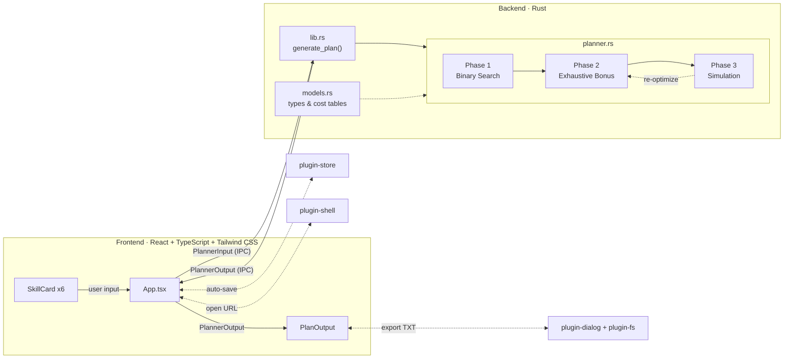

<p align="center"></p>

<h1 align="center">问剑长生 · 神通升级规划</h1>

<p align="center"><strong>手游《问剑长生》的神通升级规划桌面应用，帮助玩家计算最优的按周升级路径</strong></p>

<p align="center">
  <a href="https://github.com/yuman07/WenjianSkill/releases/latest"></a>
  <a href="https://github.com/yuman07/WenjianSkill/releases"></a>
  <a href="https://github.com/yuman07/WenjianSkill/stargazers"></a>
  <br>
  
  
  
  
  <a href="LICENSE"></a>
</p>

---

## 这是什么？

WenjianSkill 是手游《问剑长生》的**神通升级规划工具**。玩家输入 6 个战斗神通的当前状态和目标等级，应用会自动计算出达成目标所需的**最少周数**，并生成**逐周操作步骤**——兑换哪些书页、转换哪些书页、升级哪个神通，全部安排妥当。

达成目标后，引擎还会自动利用剩余资源**穷举搜索**最优的额外提升方案，确保每一份资源都不浪费。

## 功能特性

- **一键规划** — 输入 6 个战斗神通的当前状态（境界、职业、商店、等级、剩余书页）和目标等级，自动计算最少周数达成所有目标
- **逐周操作指引** — 生成每周详细步骤：兑换书页、转换书页、升级神通，按图索骥不再迷路
- **穷举最优解** — 达成目标后自动利用剩余资源继续提升等级，穷举搜索保证方案最优
- **导出方案** — 支持导出规划方案为 TXT 文件，方便分享或离线查阅
- **自动保存** — 所有设置自动持久化，重启应用后保留上次输入

<p align="center">
  
  
</p>
<p align="center">
  
  
</p>

## 安装

前往 [Releases](https://github.com/yuman07/WenjianSkill/releases/latest) 页面下载对应平台的安装包。

> **注意：** 本应用未进行代码签名，首次运行时操作系统会弹出安全警告，请按照下方说明操作。

### macOS (15.0+, Apple Silicon)

1. 下载 `WenjianSkill_macOS15_arm64_1.0.0.dmg`
2. 打开 DMG 文件，将应用拖入「应用程序」文件夹
3. 首次打开时，macOS Gatekeeper 会弹出"无法验证开发者"的提示。解决方法（任选其一）：
   - **系统设置**：前往 **系统设置 → 隐私与安全性**，找到被拦截的应用，点击「仍要打开」
   - **右键打开**：右键点击应用图标，选择「打开」，在弹出的对话框中再次点击「打开」
   - **终端命令**：在终端中执行以下命令移除隔离属性，然后再打开应用：
     ```bash
     xattr -cr /Applications/WenjianSkill.app
     ```

### Windows (10+, x64)

1. 下载 `WenjianSkill_Win10_x64_1.0.0.exe`
2. 双击即可运行，无需安装（便携式应用，可放在任意目录）
3. 首次运行时，Windows SmartScreen 会弹出「Windows 已保护你的电脑」的提示，点击「更多信息」→「仍要运行」即可

## 开发

> 仅支持 macOS，不提供其他平台的构建步骤。

项目使用 [Devbox](https://www.jetify.com/devbox/) 管理所有开发依赖（Node.js、Rust 等），无需手动安装各语言工具链。

### 前置要求

- macOS 15.6 (Sequoia) 或更高版本，Apple Silicon (M 系列芯片)
- Xcode Command Line Tools 26 或更高版本

### 构建步骤

```bash
# 1. 安装 Xcode Command Line Tools（提供编译器和系统链接器）
xcode-select --install

# 2. 安装 Devbox（项目依赖管理工具，自动安装 Node.js 24、Rust 等）
curl -fsSL https://get.jetify.com/devbox | bash

# 3. 克隆仓库
git clone https://github.com/yuman07/WenjianSkill.git

# 4. 进入项目目录
cd WenjianSkill

# 5. 安装前端依赖
devbox run -- npm install

# 6. 开发模式（热重载，前端自动刷新）
devbox run -- npm run tauri dev

# 7. 构建发布版本（生成 .dmg 安装包）
devbox run -- npm run tauri build
```

## 技术概览

WenjianSkill 采用 Tauri 2 架构，前端使用 React 渲染 UI，后端使用 Rust 执行核心规划算法。前后端通过 Tauri IPC 通信：用户在 React 界面填写技能配置和材料预算后，`App.tsx` 组装 `PlannerInput` 并调用 Rust 端的 `generate_plan` 命令，Rust 引擎执行三阶段优化算法后返回 `PlannerOutput`，前端渲染逐周操作方案。

用户状态通过 Tauri plugin-store 自动持久化到本地，规划方案可通过 plugin-dialog + plugin-fs 导出为格式化 TXT 文件。

### 核心算法

#### 资源模型

每个神通升级消耗四种资源：

| 资源 | 来源 | 约束 |
|------|------|------|
| **本体书页** | 技能自身周期收入 + 同商店转换 | 同商店内互转，每次 40 页，消耗转换次数 |
| **金色书页** | 其他技能的多余书页 + 狗粮池 | 自身盈余不能充当自己的金色 |
| **紫色书页** | 全局每周固定收入 | 全局共享池 |
| **蓝色书页** | 全局每周固定收入 | 全局共享池 |

不同境界和职业的组合映射到 6 张消耗表（如「人界三系」「返虚百族」「合体三系」等），决定每级升级的具体消耗。5 个商店（论剑/诸天/宗门/道蕴/百族）各自维护独立的书页池和狗粮池。商店有珍贵度权重（论剑 1 < 诸天=宗门 2 < 道蕴 3 < 百族 4），影响金色消耗的优先顺序。

#### 阶段一：二分搜索最少周数

给定周数 W，O(n) 可行性检查验证以下四个约束是否全部满足：

1. **紫色/蓝色书页充足** — 初始存量 + W 周收入 >= 所有技能的总需求。紫色和蓝色是纯累加的全局资源，无转换机制，简单求和即为精确判定
2. **各商店本体书页充足** — 每个商店内的技能书页 + 狗粮池 >= 该商店所有技能的本体总需求。书页只能在同商店内转换，不能跨商店流动，因此每个商店的守恒等式独立成立，按商店分别检查即充要
3. **转换次数充足** — 本体不足的技能需要通过转换补足，总转换次数 <= 免费次数 x (W+1) + 转换石（W+1 是因为第 0 周也可转换）。每次转换恰好产出 40 页，缺口除以 40 上取整即为所需次数，总数对比总容量即可
4. **金色书页充足** — 分两层检查：首先全局盈余（各商店书页 + 狗粮池 - 本体需求）>= 金色总需求；然后逐个技能检查：排除自身盈余后的可用金色 >= 该技能的金色需求。第二层必不可少，因为自身的盈余不能充当自己的金色——仅做全局检查会高估可用金色

这四个约束构成了可行性的**充要条件**：紫/蓝是独立累加资源，商店间书页不互通，转换次数与页数有固定比例，金色的自引用约束被逐技能检查覆盖。因此可行性是关于周数 W 的单调递增函数——W 越大，收入越多，一旦可行则更大的 W 必然可行。这一单调性保证了二分搜索的正确性。在 \[0, 500\] 范围搜索，O(n log 500) 约 9n 次检查即可找到精确最少周数。

#### 阶段二：穷举搜索 bonus 等级

达成目标后通常有剩余资源。引擎穷举每个技能从目标到该消耗分类最高等级（天 3 或天 5）的组合，对每种组合调用阶段一可行性检查，取总等级提升最大的可行方案。穷举保证了全局最优——不同于贪心策略可能陷入的局部最优，穷举搜索不会遗漏任何可行的 bonus 组合。

搜索采用分支定界（branch-and-bound）剪枝加速：从高 bonus 向低 bonus 搜索以尽早找到好基线，用「当前累计 + 剩余上界 <= 已知最优」跳过不可能更优的分支。虽然最坏情况是指数级，但每次可行性检查仅 O(n)，加上剪枝在实际场景中非常高效（6 个技能、每个最多十几级 bonus），实测在微秒级完成。

#### 阶段三：逐周模拟

确定最终目标后，模拟器按周推进。每周执行三个步骤：

**1. 结算收入：** 各技能按各自周期发放书页，狗粮池按各自周期增长，紫色/蓝色书页按周增加。

**2. 交替执行转换与升级：** 循环直到无法继续。每轮先尝试所有可升级的技能，再尝试一次转换，升级可能释放新的资源使更多转换有意义，转换可能补足本体使更多升级可行，交替进行直到无进展。

升级优先级（二维排序）：
- 第一维：下一级金色需求越少越优先——金色是跨技能共享的稀缺资源，低消耗的升级先做可以减少对共享池的竞争，避免一个高消耗升级独占金色导致其他技能全部卡住
- 第二维：同等金色需求下，离目标越近越优先——尽早完成一个技能可以释放其全部书页作为盈余，为其他技能提供更多金色来源

转换目标选择：只对下一级本体需求大于当前持有量的技能转换（排除仅被金色/紫色/蓝色卡住的技能——为这些技能转换本体不会推动任何升级，纯属浪费转换次数），按本体缺口从小到大排序（缺口最小意味着一次转换最可能直接触发升级）。

转换来源优先级：同商店狗粮池 > 同商店其他技能的盈余。狗粮池是"无主"资源，消耗它不影响任何技能自身的升级进度；而消耗其他技能的盈余会减少其金色贡献潜力，应作为后备。

转换槽位优先级（三层）：前 3 次免费转换 > 转换石 > 剩余免费转换次数。免费次数每周刷新不累积，不用就浪费；转换石是有限一次性资源，夹在中间确保紧急时可用但不过度消耗；剩余免费次数放最后，为后续周保留灵活性。

金色消耗优先级：珍贵度低的资源优先消耗（论剑 > 诸天=宗门 > 道蕴 > 百族）。高珍贵度商店的书页更稀缺（收入少、可替代来源少），保留它们用于同商店的本体转换更有价值。同时每商店有金色预算上限（盈余 - 被排除技能的贡献），防止金色消耗透支同商店的转换能力。

**3. 记录快照：** 保存每步操作（兑换、转换、升级的详细参数）和周末状态，最终输出为逐周操作计划。

#### 迭代收敛

阶段一的可行性检查使用聚合转换容量（总转换次数不区分周），而阶段三的模拟器执行每周转换上限。这是有意的设计权衡：聚合模型让可行性检查保持 O(n) 的简洁性（作为阶段二的内层循环被频繁调用），但会乐观估计——有些在聚合模型下可行的方案，在逐周模拟中可能因为每周瓶颈而需要更多周。

当模拟实际周数超出阶段一预期时，额外周数带来了额外收入。引擎会用实际周数重新运行阶段二以利用这些额外资源（可能发现更高的 bonus 等级），再用新目标重新模拟。此迭代重复直到 bonus 等级不再提升——通常 1-2 轮收敛，上限 10 轮。

### 技术栈

| 层级 | 技术 |
|------|------|
| 桌面框架 | Tauri 2 (macOS / Windows) |
| 前端 | React 19 + TypeScript 6 + Tailwind CSS 4 |
| 前端构建 | Vite 8 |
| 后端算法 | Rust (Edition 2024) |
| 开发环境 | Devbox (Node.js 24, Rust 1.95+) |

### 架构



- **数据流**：用户在 6 个 SkillCard 中填写技能配置，App.tsx 组装 `PlannerInput` 通过 Tauri IPC 发送给 Rust 后端，`lib.rs` 调用 `planner.rs` 执行三阶段算法，返回 `PlannerOutput` 由 PlanOutput 组件渲染逐周方案
- **三阶段管线**：Phase 1 二分搜索最少周数 → Phase 2 穷举搜索 bonus 等级 → Phase 3 逐周模拟生成操作步骤。若模拟实际周数超出预期，Phase 3 会回溯触发 Phase 2 重新优化，迭代直至收敛
- **Tauri 插件**（虚线）：plugin-store 为 App 提供状态自动持久化；plugin-dialog + plugin-fs 为 PlanOutput 提供导出 TXT 的文件选择和写入能力；plugin-shell 用于打开外部链接

### 项目结构

```
|-- src/                        # 前端（React + TypeScript）
|   |-- App.tsx                 #   主界面：管理 6 个技能输入状态、材料设置、调用后端
|   |-- components/
|   |   |-- SkillCard.tsx       #   技能卡片：境界/职业/商店/等级/书页输入
|   |   `-- PlanOutput.tsx      #   规划结果：逐周展开卡片、导出 TXT
|   |-- types/
|   |   |-- game.ts             #   游戏数据：枚举定义、升级消耗表、商店收入默认值
|   |   `-- planner.ts          #   规划器接口：输入/输出类型、周计划、快照
|   `-- utils/
|       |-- persistence.ts      #   本地持久化（Tauri plugin-store）
|       |-- exportText.ts       #   导出规划方案为格式化文本
|       `-- donorLabel.ts       #   狗粮池/技能索引 -> 显示名称映射
|-- src-tauri/                  # 后端（Rust）
|   |-- src/
|   |   |-- main.rs             #   Tauri 入口：注册插件和命令
|   |   |-- lib.rs              #   导出 generate_plan 命令，衔接前后端
|   |   |-- models.rs           #   数据模型：枚举、消耗表、输入输出结构体
|   |   `-- planner.rs          #   核心算法：二分搜索 + 穷举 bonus + 逐周模拟
|   |-- tauri.conf.json         #   Tauri 配置：窗口尺寸、打包、最低系统版本
|   `-- Cargo.toml              #   Rust 依赖与发布优化配置
|-- devbox.json                 # 开发环境依赖（Node.js、Rust）
|-- package.json                # 前端依赖
`-- vite.config.ts              # Vite 构建配置
```

## License

[MIT](LICENSE)
